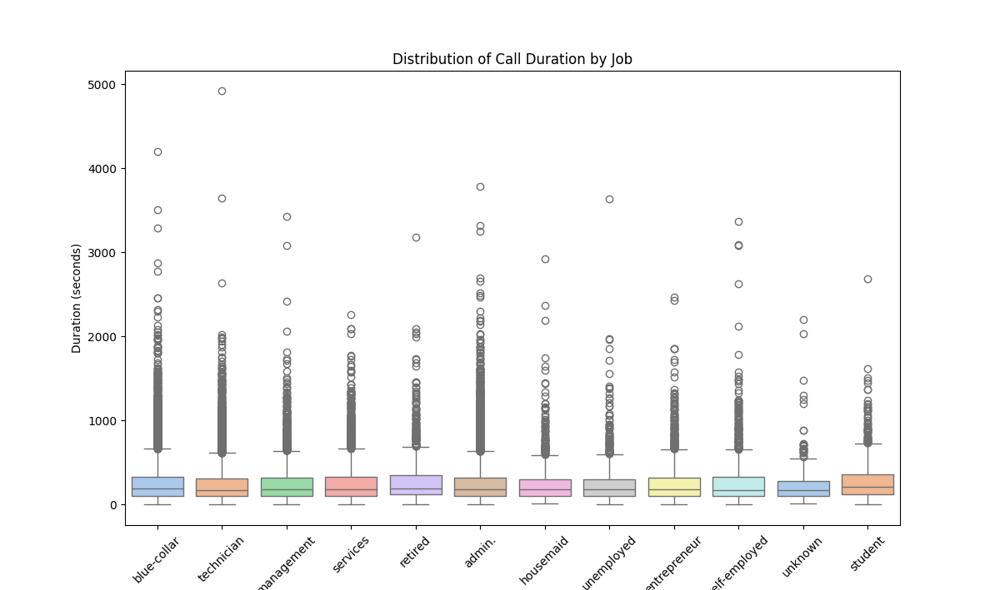

# Analysis of Sales Data with Python🐍

This Python script analyzes sales data from a CSV file and performs various operations including data cleaning, basic analysis, and visualization.


## 🧾 Table of Contents 

- [Installation](#installation)
- [Usage](#usage)
- [Data Analysis Methods](#Data_Analysis_Methods)
- [Data_Visualization](#data_visualization)
- [License](#license)


## 🛠️ Installation

1. Clone the repository from Dragons Bootcamp LLC:

    ```bash
    git clone https://github.com/Mado007/bank-data-analysis.git
    ```

2. Navigate to the project directory:

    ```bash
    cd bank-data-analysis
    ```

3. Install the required Python dependencies:

    ```bash
    pip install -r requirements.txt
    ```

## 📊 Usage

1. Ensure that the CSV file containing the sales data is placed in the project directory.

2. Run the Python script `banking_sales_analysis.py`:

    ```bash
    python banking_sales_analysis.py
    ```
3. Follow the prompts to perform data analysis and visualization.

   
## 📈 Data_Analysis_Methods

- **Data Visualization**: Utilized matplotlib and seaborn libraries to create visual representations of the data including histograms

- **Descriptive Statistics**: Calculated summary statistics such as mean, median, mode, and standard deviation to understand the central tendency and variability of the data.

- **Grouping and Aggregation**: Grouped the data based on different categorical variables and performed aggregation functions to summarize the information within each group.


## Data_Visualization





## 🔑License

This project is licensed under the MIT License. See the [LICENSE](LICENSE) file for details.

## © Credits

This assignment was completed as part of the Dragons Bootcamp LLC curriculum. Credit goes to [Dragons Bootcamp LLC](https://github.com/dragonsbootcampllc) for providing the assignment and supporting materials.
